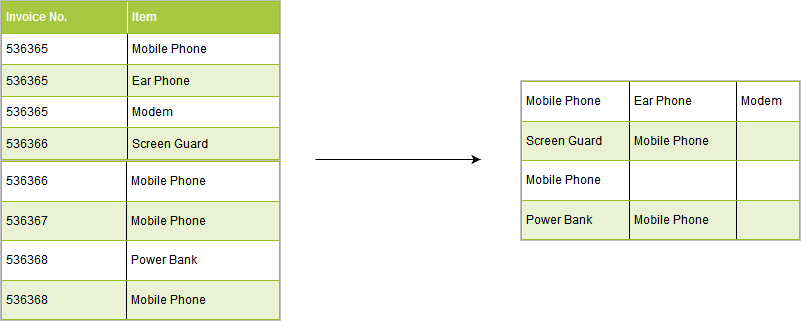

<!-- README.md is generated from README.Rmd. Please edit that file -->

```{r setup, include = FALSE}
knitr::opts_chunk$set(
  collapse = TRUE,
  comment = "#>",
  fig.path = "man/figures/README-",
  out.width = "100%"
)
```
# mbar

[](https://travis-ci.org/rsquaredacademy/mbar) [](https://ci.appveyor.com/project/rsquaredacademy/mbar) [](https://codecov.io/github/rsquaredacademy/mbar?branch=master)

> Helper functions used in our online R courses

## Installation

```{r installation, eval = FALSE}
# Install development version from GitHub
# install.packages("devtools")
devtools::install_github("rsquaredacademy/mbar")
```

## Usage

### Data pre-processing for Market Basket Analysis

```{r load, eval=TRUE, echo=FALSE}
library(mbar)
```

```{r demo, fig.align='center', echo=FALSE}

```

<br>

`mbar_prep_data()` will modify the data from one row per item to 
one row per transaction. It takes 3 inputs:

- data set
- invoice number column
- product/item column

```{r usage}
# original data
head(mba_sample)

# modified data
mbar_prep_data(mba_sample, InvoiceNo, Description)
```

### Optimal Complexity Parameter

`optimal_cp()` will extract the optimal complexity parameter from an object 
of class `rpart` for pruning a tree.

```{r optimcp}
# grow tree
model   <- rpart::rpart(Species ~ ., data = iris)
best_cp <- optimal_cp(model)

# prune tree
rpart::prune(model, cp = best_cp)
```

Please note that the 'mbar' project is released with a [Contributor Code of Conduct](CODE_OF_CONDUCT.md). By contributing to this project, you agree to abide by its terms.
